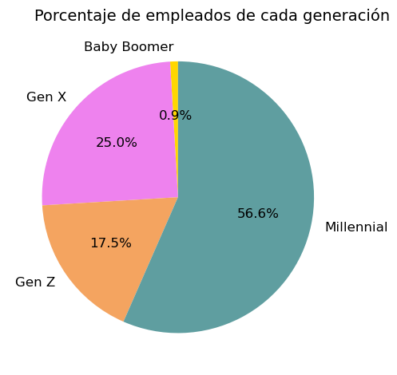

# Project Report: Employee Retention and Job Satisfaction at ABC Corporation

## 🌟 Project Objective

With the goal of reducing employee turnover and improving job satisfaction, **ABC Corporation** has hired us to develop a data analysis project. Our mission is to identify the **key factors** that influence **job satisfaction** and ultimately **employee retention**.

---

## 📊 Project Overview

- **Client**: ABC Corporation  
- **Team**: 4ward Thinkers  
- **Estimated Duration**: 03/18/2025 - 04/09/2025  
- **Tools and Technologies**: Python, Numpy, Pandas, Seaborn, Matplotlib

---

## 🗂️ Data Source and Preparation

### 1. Data Source

**DataFrame**: `hr_raw_data.csv`

- `Age`: Employee's age.
- `Attrition`: Indicates whether the employee left the company (Yes/No).
- `BusinessTravel`: Frequency of business travel (e.g., travel_rarely).
- `DailyRate`: Estimated daily rate for clients, based on salary.
- `Department`: Employee's department.
- `DistanceFromHome`: Distance in miles or kilometers from home to work.
- `Education`: Employee's education level on a numeric scale.
- `EducationField`: Employee's academic field of study.
- `EmployeeCount`: Constant value of "1," indicating one employee per record.
- `EmployeeNumber`: Employee ID number.
- `EnvironmentSatisfaction`: Satisfaction level with the work environment.
- `Gender`: Employee's gender.
- `HourlyRate`: Calculated hourly rate.
- `JobInvolvement`: Employee's level of involvement at work.
- `JobLevel`: Hierarchical level of the employee's role.
- `JobRole`: Specific job function.
- `JobSatisfaction`: Overall job satisfaction.
- `MaritalStatus`: Marital status (e.g., Single, Married).
- `MonthlyIncome`: Estimated monthly income based on annual salary.
- `MonthlyRate`: Estimated monthly rate based on daily rate.
- `NumCompaniesWorked`: Number of previous companies the employee has worked at.
- `OverTime`: Indicates whether the employee works overtime (Yes/No).
- `PercentSalaryHike`: Percentage salary increase.
- `PerformanceRating`: Performance evaluation on a numeric scale.
- `RelationshipSatisfaction`: Satisfaction with workplace relationships.
- `StandardHours`: Work schedule classification (Full Time/Part Time).
- `StockOptionLevel`: Stock option level assigned.
- `TotalWorkingYears`: Total years of work experience.
- `TrainingTimesLastYear`: Number of training sessions in the past year.
- `WorkLifeBalance`: Work-life balance level.
- `YearsAtCompany`: Years at the current company.
- `YearsInCurrentRole`: Years in current role.
- `YearsSinceLastPromotion`: Years since the last promotion.
- `YearsWithCurrManager`: Years with the current manager.
- `DateBirth`: Employee's year of birth.
- `Salary`: Calculated annual salary.
- `RoleDepartment`: Combination of role and department.
- `NumberChildren`: Number of children (if available).
- `RemoteWork`: Indicates if the employee works remotely (Yes/No).

**DataFrame**: `labor_force_participation_rate_by_age_group.csv`

- Source: [California Open Data Portal](https://data.ca.gov/dataset/labor-force-participation-rate-by-age-group/resource/d58bfa55-8f7f-438f-9e46-0cae78a80d91)

### 2. Data Cleaning and Preprocessing

- Column name unification
- Removal of null values
- Encoding of categorical variables
- Normalization / standardization
- Outlier detection
- Filtering of columns for analysis

For more details, refer to the [data documentation](https://docs.google.com/spreadsheets/d/1pLfwP7zJ8qAkEuVE2P4qM-kj6z-0E_emVTnwHtOpboE/edit?usp=sharing).

---

## 🔍 Exploratory Data Analysis (EDA)

- Distribution of key variables (age, seniority, department, salary, etc.)
- Correlation analysis
- Visualization of key insights (histograms, bar charts, pie charts, line plots, scatter plots)
- Comparisons between satisfied and unsatisfied employees
- Classification of employees by generation (Baby Boomers, Gen X, Millennials, Gen Z)
- Comparisons focused on gender and age

---

## 🤔 Visual Analysis

### 1. Analysis Focus

The initial scope of the project focuses on **identifying key patterns and factors** related to employee satisfaction and turnover. An exploratory and descriptive approach based on visualizations and correlation analysis was chosen. The analysis centers on identifying trends by age and gender within ABC Corporation, aiming to determine whether equality is a key factor in job satisfaction.

### 2. Main Visualizations Generated

- Job satisfaction distribution by department, age, salary level, and gender
- Identification of roles with the lowest satisfaction
- Identification of age groups at higher risk of attrition or low satisfaction
- Comparison of salary levels by gender and age

### 3. Key Insights

  

Based on data analysis, visualizations, and key comparisons, several relevant factors were identified that may directly influence job satisfaction and talent retention within the company:

- **Generational composition**: A clear majority of *Millennials*, fewer *Baby Boomers*. *Gen X* is evenly distributed. Leadership is dominated by older generations due to tenure and experience.

- **Salary analysis**: Higher salaries for those with doctoral degrees, especially *Gen X*. *Gen Z* doesn't follow this pattern. No clear relationship between salary and job satisfaction.

- **Role distribution**: *Millennials* in diverse roles; *Gen X* and *Baby Boomers* in leadership. Indicates potential **promotion barriers** for younger generations.

- **Job satisfaction**: Generally positive. *Baby Boomers* more dissatisfied, *Millennials* most satisfied, *Gen X* shows polarization. Specific roles (Sales Executives, Laboratory Technicians, HR) with lower satisfaction.

- **Gender insights**: Women are the majority and present in senior roles, but **men earn higher salaries**, especially with higher education. Recommends reviewing equity policies to address hidden disparities.

---

## 📌 Conclusions and Recommendations

### 📌 Key Analysis Conclusions

- **Generational distribution** confirms a *Millennial* majority; *Baby Boomers* lead leadership roles.

- **No direct correlation between salary and job satisfaction** found despite education or age.

- **Promotion programs** recommended for *Millennials* and *Gen Z* into leadership roles.

- **Job satisfaction** differs by generation and role. Key improvement areas include:
  - *Baby Boomers*: more dissatisfaction
  - *Millennials*: more satisfied
  - *Gen X*: polarized responses
  - Roles: *Sales Executives*, *Lab Technicians*, *HR* departments

- **Gender analysis**: salary gap in favor of men despite women's leadership presence. Suggests **policy review for equity**.

---

## 🔾 Appendices

- [Original data details (Google Sheets)](https://docs.google.com/spreadsheets/d/1pLfwP7zJ8qAkEuVE2P4qM-kj6z-0E_emVTnwHtOpboE/edit?usp=sharing)
- [California Open Data Portal](https://data.ca.gov)

---

## ✍️ Authors

- **Amanda Hernández** – SCRUM Master 1. Data Analyst.  
- **Nuria Salas** – SCRUM Master 2. Data Analyst.  
- **Cristina Martín** - Data Analyst.  
- **Marianela Gómez** - Data Analyst.
